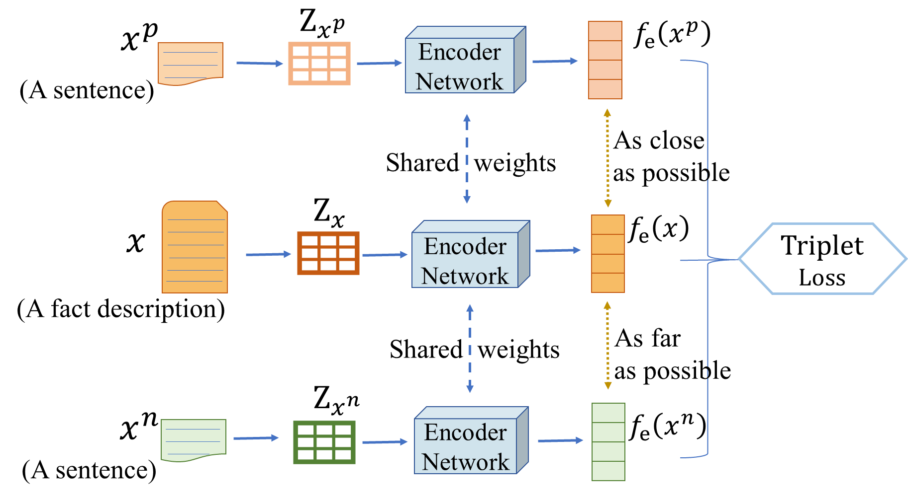
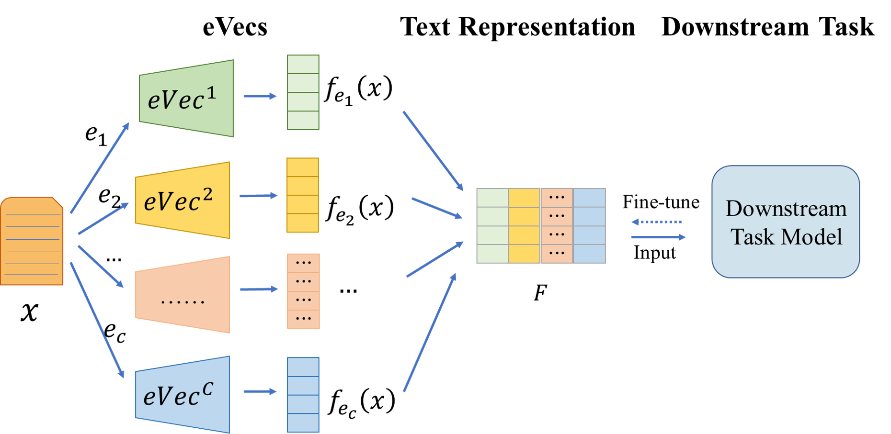

# Learning Legal Text Representations via Disentangling Elements
Implementation of paper "Learning Legal Text Representations via Disentangling Elements" published at ESWA 2024.


## Overview
Recently, a rising number of works has been focusing on tasks in the legal field for providing references to
professionals in order to improve their work efficiency. Learning legal text representations, being the most
common initial step, can strongly influence the performance of downstream tasks. Existing works have shown
that utilizing domain knowledge, such as legal elements, in text representation learning can improve the
prediction performance of downstream models.

 However, existing methods are typically focused on specific
downstream tasks, hindering their effective generalization to other legal tasks. Moreover, these models tend
to entangle various legal elements into a unified representation, overlooking the nuances among distinct legal
elements. To solve the aforementioned limitation this study introduces two models, eVec and eVecs, specifically designed to address the challenge of accurately representing legal texts by disentangling element-specific information. 

<div align=center>

</div>

The eVec model addresses the problem by employing a triplet loss function to learn discriminative representations of legal texts concerning specific elements. The triplet loss helps in distinguishing similar legal elements from dissimilar ones by minimizing the distance between similar elements while maximizing the distance between dissimilar ones.  

<div align=center>

</div>

Extending the capabilities of the eVec model, the eVecs framework provides a comprehensive solution for learning disentangled representations across multiple legal elements. It employs multiple eVec models, each dedicated to capturing the specific characteristics of a different legal element.

The eVec aims to learn a disentangled
representation that maximally preserves the information relevant to a specific element while omitting irrelevant element
information. The learned representations are task-independent and can be
directly applied to multiple tasks or fine-tuned for different downstream tasks.
The benefit of our model is even more
noticeable when only a small quantity of labeled data is accessible.


## Dataset

The original download link for the dataset: : http://cail.cipsc.org.cn/task_summit.html?raceID=2&cail_tag=2019

This dataset covers three domains: marriage and family, labor disputes, and loan contracts. We provide the triples and training data for the loan contracts domain.


## Bibliography
```
@article{MIAO2024123749,
title = {Learning legal text representations via disentangling elements},
journal = {Expert Systems with Applications},
volume = {249},
pages = {123749},
year = {2024},
issn = {0957-4174},
doi = {https://doi.org/10.1016/j.eswa.2024.123749},
url = {https://www.sciencedirect.com/science/article/pii/S0957417424006158},
author = {Yingzhi Miao and Fang Zhou and Martin Pavlovski and Weining Qian},
keywords = {Legal text representations, Elements, Disentangled representations}
}
```

